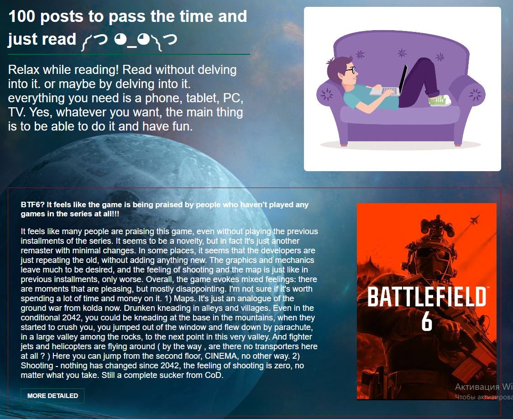

# 📝 100 posts - to pass the time and just read
---

<p align="center">
  
</p>

## The following technologies are used in this project:
 NEXT.js + Tanstack/react-query 


## Getting Started

First, run the development server:

```bash
npm run dev
# or
yarn dev
# or
pnpm dev
# or
bun dev
```

Open [http://localhost:3000](http://localhost:3000) with your browser to see the result.


